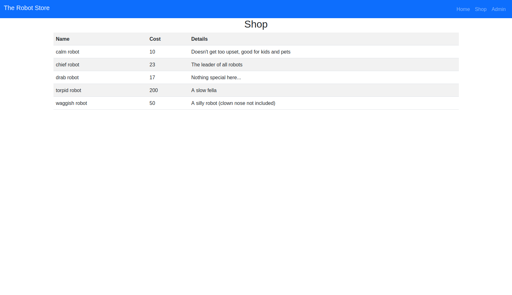

# php-demo



## Setup - Linux

1. Install [XAMPP](https://www.apachefriends.org/index.html)

2. Start XAMPP server

```
sudo /opt/lampp/lampp start
```
3. Create the database
```
mysql -u root -p
mysql> CREATE DATABASE php_demo
```
4. Populate the database
```
mysql -u root -p  --socket=/opt/lampp/var/mysql/mysql.sock php_demo < db/schema.sql
```
5. Move the project files to your htdocs/ folder in your XAMPP installation
```
make
```
_note:_ You will be prompted for sudo

6. Navigate to [localhost/public](http://localhost/public)

## Setup - Windows

1. Install [XAMPP](https://www.apachefriends.org/index.html)

2. Start XAMPP server
```
\xampp\xampp-control.exe
```
3. Create the database
```
\xampp\mysql\bin\mysql.exe –u root –p
mysql> CREATE DATABASE php_demo
```
4. Populate the database
```
\xampp\mysql\bin\mysql.exe –u root –p php_demo < db\schema.sql
```
5. Move the project files to your htdocs/ folder in your XAMPP installation

6. Navigate to [localhost/public](http://localhost/public)
